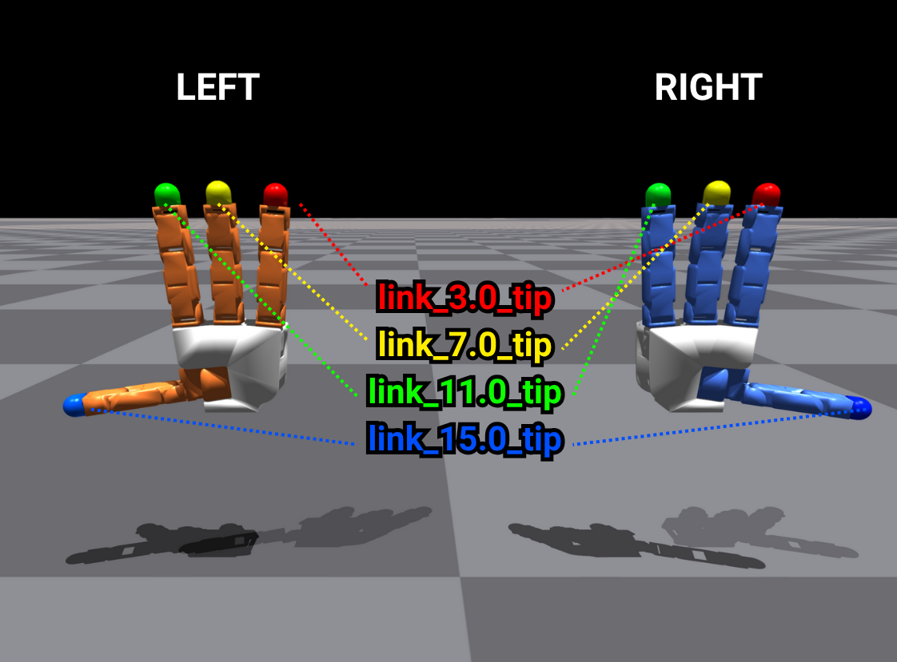
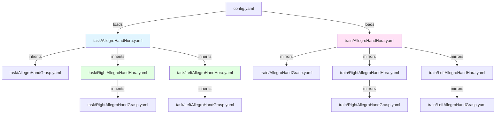
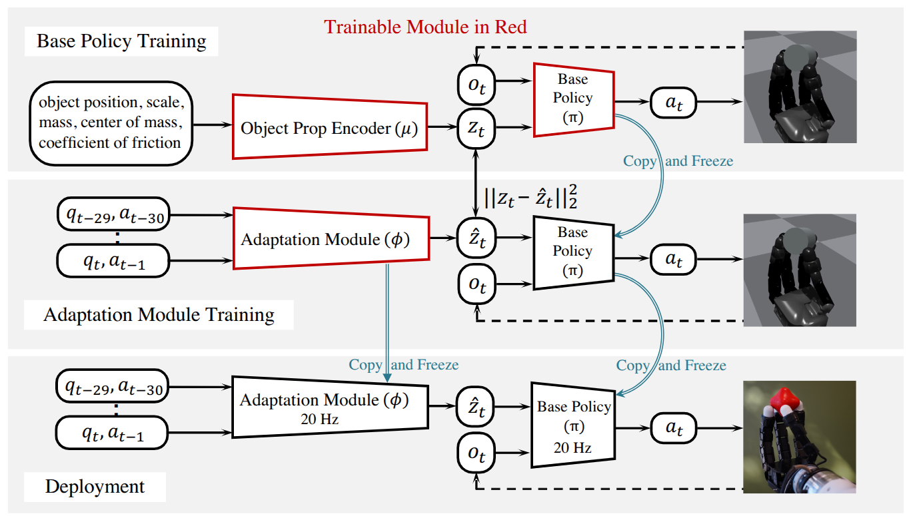

# allegro_inhand_rotation

Reference Implementation of In-Hand Object Rotation for Allegro Hand Platforms

This repository provides an implementation example for in-hand object rotation using the **Allegro Hand Platforms**.
It combines a ROS2-based hardware controller with an AI-driven manipulation algorithm originally developed for in-hand rotation research.

This implementation currently supports **Allegro Hand V4**, but the software architecture is designed to be modular and extendable.
As additional robotic hand platforms are developed within our organization, this codebase may be expanded to include **plug-in modules and adapters** for new hardware versions, enabling broader compatibility across future Wonik Robotics hand systems.

This codebase utilizes:

- **Allegro Hand ROS2 Controller**
  https://github.com/Wonikrobotics-git/allegro_hand_ros2
- **AI Algorithm: In-Hand Object Rotation via Rapid Motor Adaptation (RMA)**
  Original research & implementation by Haozhi Qi
  https://haozhi.io/hora/


## Test System Configuration

- Ubuntu 22.04
- ROS2 Humble
- Allegro Hand V4
- IsaacGym 4.0 Simulator

## System Requirements

### 1. Isaac Gym 4.0 Installation

Download: [https://developer.nvidia.com/isaac-gym/download](https://developer.nvidia.com/isaac-gym/download)


### 2. Allegro Hand ROS2 Controller

This project operates based on the official controller:

**👉 [WonikRobotics-git/allegro_hand_ros2](https://github.com/WonikRobotics-git/allegro_hand_ros2)**

Refer to the official repository for detailed installation and setup instructions. You will need this for real-world deployment.

### 3. Python Environment Setup

> [!IMPORTANT]
> **Two separate Python environments are required** due to incompatible version requirements:
> - **Training (Isaac Gym):** Requires Python 3.6–3.8
> - **Deployment (ROS 2 Humble):** Requires Python 3.10+

We use two Conda environments to handle this incompatibility:

#### Environment 1: `hora` (For Training in Isaac Gym)

```bash
# Create environment with Python 3.8
conda create -n hora python=3.8

# Activate environment
conda activate hora

# Install Isaac Gym (after downloading and extracting)
cd /path/to/isaacgym/python
pip install -e .

# Install training dependencies
pip install -r hora_requirements.txt
```

**Use this environment for:**
- Training policies in simulation
- Running `train.py`, `eval_s1.sh`, `eval_s2.sh`, etc.
- Generating grasp poses

#### Environment 2: `allegro` (For Real-world Deployment)

```bash
# Create environment with Python 3.10
conda create -n allegro python=3.10

# Activate environment
conda activate allegro

# Install deployment dependencies
pip install -r allegro_requirements.txt
```

**Use this environment for:**
- Deploying trained policies to physical Allegro Hand hardware
- Running ROS 2 nodes and controllers
- Running `deploy_one_hand.sh`, `deploy_two_hands.sh`, etc.

### 4. Verify Installation

After setting up both environments, verify they work correctly:

#### Check 1: `hora` Environment (Training)

Verify Isaac Gym and dependencies are installed correctly:

```bash
conda activate hora
python compare_hands.py
```

**Expected output:** Isaac Gym GUI will display both hand versions side-by-side, showing the fingertip geometry differences between Allegro Hand V4 and the modified version used in the original HORA implementation.

<p align="center">
  
</p>

> **Troubleshooting:** If you encounter this error:
> ```
> ImportError: libpython3.8.so.1.0: cannot open shared object file: No such file or directory
> ```
> Set the library path and try again:
> ```bash
> export LD_LIBRARY_PATH=/path/to/conda/envs/hora/lib:$LD_LIBRARY_PATH
> python compare_hands.py
> ```

#### Check 2: `allegro` Environment (Deployment)

> **Note:** This check requires physical Allegro Hand hardware and ROS 2 setup. Skip if you only want to train in simulation.

**Step 1:** Launch the ROS 2 hand controller (in a separate terminal):

```bash
# Navigate to your allegro_hand_ros2 workspace
cd /path/to/allegro_hand_ros2_ws
source install/setup.bash

# Launch controller
ros2 launch allegro_hand_bringup allegro_hand.launch.py
```

**Step 2:** Test the deployment interface:

```bash
conda activate allegro
python hora/algo/deploy/robots/allegro_ros2.py
```


## Run

> **Note:** This repository focuses on **Allegro Hand V4 (Right and Left)** versions. The original HORA repository used different fingertip geometries, resulting in slightly different finger lengths. See the comparison images below for details.

### Verify Allegro Right/Left URDF

To verify the URDF configurations for both hands, you can visualize them in Isaac Gym:

```bash
python allegro_right_left.py
```

This script loads both the right and left hand models in a single environment, allowing you to compare their kinematics and collision geometries side by side.

**URDF Files Location:**
- Right hand: `assets/allegro/allegro_right.urdf`
- Left hand: `assets/allegro/allegro_left.urdf`

**Visualization:**

<p align="center">
  
</p>

**Fingertip Geometry Comparison:**

<p align="center">
  
</p>

The images above show the differences between the original HORA fingertips and the standard Allegro Hand V4 fingertips used in this repository.

### Configuration Structure

This repository uses [Hydra](https://hydra.cc/) for hierarchical configuration management. Configs are organized in `configs/` directory:

- **`config.yaml`** - Main entry point (sets device, physics engine, defaults)
- **`task/*.yaml`** - Environment settings (rewards, randomization, URDF paths)
- **`train/*.yaml`** - Training parameters (PPO hyperparameters, network architecture)

#### Configuration Inheritance Diagram



**Config Types:**
- **Hora** = In-hand rotation (training/testing)
- **Grasp** = Grasp pose generation only
- **Right/Left** = Hand-specific URDF and grasp caches

**Usage:**
```bash
# Default (AllegroHandHora)
python train.py

# Specific task with overrides
python train.py task=RightAllegroHandHora train.ppo.learning_rate=1e-4
```

### Generate Grasping Poses

To achieve a stable initial grasp, you must prepare reliable grasp poses for the target objects.

**Download pre-generated grasp poses:**

1. Download the grasp pose files from [HuggingFace](https://huggingface.co/datasets/Wonik-Robotics/allegro_inhand_rotation)
2. Extract and place the `cache/` folder in the project root directory

Your directory structure should look like:
```
allegro_inhand_rotation/
├── cache/              # Downloaded grasp poses
├── configs/
├── hora/
└── ...
```

Alternatively, you can generate grasp poses **from scratch** using the scripts included in this repository:

```bash
scripts/gen_grasp.sh 0 # GPU ID
```

This script will run the full grasp-pose generation pipeline and produce the necessary `.npy` files for training or evaluation.

If you have multiple gpus, you can parallelize the process by running multiple instances with different GPU IDs:

```bash
scripts/gen_grasp_multigpus.sh 0 1 2
```


### Train

The training pipeline follows a two-stage approach using **Rapid Motor Adaptation (RMA)** with support for various object shapes (Ball, Cylinder, Cube, etc.).

**Training Stages:**
- **Stage 1**: Teacher policy with privileged observations (object dynamics, external forces)
- **Stage 2**: Student policy using only proprioceptive observations (joint positions, velocities, history)

<p align="center">
  
</p>

> **Note**: The following instructions use **RightAllegroHandHora** as the default task. To train the left hand, modify the `task` parameter in the training scripts to `task=LeftAllegroHandHora`.

#### Stage 1: Teacher Policy Training

Train the teacher policy with privileged information:

```bash
./scripts/train_s1.sh 0 42 my_experiment
# Arguments: GPU_ID SEED RUN_NAME
```

**Quick Training Check**

To quickly test Stage 1 training, the script is already configured with minimal resources. The default settings in `scripts/train_s1.sh` are:

```bash
task.env.numEnvs=4 train.ppo.minibatch_size=32 \
```

#### Stage 2: Student Policy Training (Adaptation)

Train the student policy using proprioceptive adaptation:

```bash
./scripts/train_s2.sh 0 42 my_experiment
# Arguments: GPU_ID SEED RUN_NAME
```


### Test in Simulation

After training, you can test your policy using two methods: **evaluation** (quantitative metrics) and **visualization** (qualitative inspection).

#### Evaluation (Headless)

Runs 10,240 parallel environments in headless mode to measure success rates and performance metrics. All domain randomizations are enabled for robust testing.

```bash
# Stage 1 (Teacher policy)
./scripts/eval_s1.sh 0 my_experiment  # GPU_ID RUN_NAME

# Stage 2 (Student policy)
./scripts/eval_s2.sh 0 my_experiment  # GPU_ID RUN_NAME
```


#### Visualization (Visual Inspection)

Renders 64 environments with GUI to visually inspect policy behavior. Most randomizations are disabled for clearer observation.

```bash
# Stage 1 (Teacher policy)
./scripts/vis_s1.sh my_experiment  # RUN_NAME

# Stage 2 (Student policy with tennis ball)
./scripts/vis_s2.sh my_experiment  # RUN_NAME
```

<p align="center">
  
</p>

#### Debugging

Enable debugging tools to visualize policy behavior and save action data for analysis.

**Enable in `configs/task/AllegroHandHora.yaml`:**

```yaml
env:
  enableDebugPlots: True        # Visualize DOF trajectories (PNG plots)
  enableActionRecording: True   # Save action history (NPZ file)
```

**Output** (saved to `debug/` directory):
- `obs_debug_*.png`, `allegro_debug_*.png` - Joint trajectories and commands
- `actions_500.npz` - First 500 actions from environment 0

### Test in Real-world

Deploy your trained policy to physical Allegro Hand hardware. This requires switching to the `allegro` conda environment (Python 3.10+) for ROS 2 compatibility.

#### Prerequisites

Before starting, ensure:
- Allegro Hand(s) connected via USB and powered on
- CAN interface hardware properly installed
- [allegro_hand_ros2](https://github.com/WonikRobotics-git/allegro_hand_ros2) package installed and built
- ROS 2 workspace sourced (`source install/setup.bash`)
- `allegro` conda environment activated (`conda activate allegro`)

#### Step 1: CAN Network Setup

Configure CAN bus interface for hand communication. The bitrate must be set to 1,000,000 for Allegro Hand V4.

**Single Hand (can0 only):**

```bash
sudo ip link set can0 down
sudo ip link set can0 type can bitrate 1000000
sudo ip link set can0 up
```

**Dual Hand (can0 + can1):**

```bash
# Right hand on can0
sudo ip link set can0 down
sudo ip link set can0 type can bitrate 1000000
sudo ip link set can0 up

# Left hand on can1
sudo ip link set can1 down
sudo ip link set can1 type can bitrate 1000000
sudo ip link set can1 up
```

**Verify CAN connection:**
```bash
candump can0  # Should show periodic CAN messages if hand is connected
```

#### Step 2: Launch ROS 2 Hand Controller

Start the ROS 2 controller node that manages hand hardware communication.

**Single Hand:**

```bash
ros2 launch allegro_hand_bringup allegro_hand.launch.py
```


**Dual Hand:**

```bash
ros2 launch allegro_hand_bringup allegro_hand_duo.launch.py
```


> [!IMPORTANT]
> Controller command topics differ based on setup:
> - **Single hand:** `allegro_hand_position_controller/commands`
> - **Dual hands:** `allegro_hand_position_controller_r/commands` and `allegro_hand_position_controller_l/commands`

> **Note:** Keep this terminal running. Open a new terminal for the next step.

#### Step 3: Deploy HORA Algorithm

> [!IMPORTANT]
> Make sure you have activated the `allegro` conda environment before running deployment scripts:
> ```bash
> conda activate allegro
> ```

Run the trained policy on the physical hardware. The deployment script loads Stage 2 (student) checkpoints and executes the policy in real-time.


**Single Hand:**

Since previous training examples used `RightAllegroHandHora`, the deploy script defaults to loading from that directory:

```bash
scripts/deploy_one_hand.sh my_experiment
# Loads: outputs/RightAllegroHandHora/my_experiment/stage2_nn/best.pth
```

<p align="center">
  
</p>

**Dual Hand:**

For dual hand deployment, specify checkpoint names for both hands. Each hand loads from its respective training directory:

```bash
# Different experiments for each hand
scripts/deploy_two_hands.sh exp_right exp_left
# Right: outputs/RightAllegroHandHora/exp_right/stage2_nn/best.pth
# Left:  outputs/LeftAllegroHandHora/exp_left/stage2_nn/best.pth

# Same experiment name, different hand directories
scripts/deploy_two_hands.sh my_experiment
# Right: outputs/RightAllegroHandHora/my_experiment/stage2_nn/best.pth
# Left:  outputs/LeftAllegroHandHora/my_experiment/stage2_nn/best.pth
```

---

## License

This repository is licensed under the MIT License.

- Modifications and integration by [**Wonik Robotics**](https://github.com/Wonikrobotics-git) (© 2025)

The full license text is available in the [LICENSE](./LICENSE) file.
